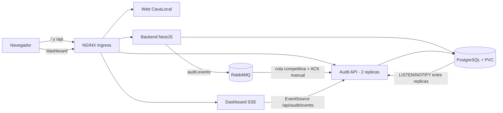

# CavaLocal - auditoria distribuida en Kubernetes

Implementacion de la evaluacion conjunta: el backend NestJS publica los cambios del marketplace en RabbitMQ, dos replicas del microservicio de auditoria los persisten con ACK manual y el dashboard los recibe en tiempo real mediante Server-Sent Events (SSE).

## Arquitectura



El UUID de cada mensaje es clave primaria en `audit_events`: una redelivery de RabbitMQ no duplica la traza. PostgreSQL `LISTEN/NOTIFY` distribuye la notificacion a ambas replicas, por lo que cualquier conexion SSE recibe el evento aunque otra replica haya consumido el mensaje.

## Requisitos cubiertos

| Requisito | Implementacion |
|---|---|
| Cinco entidades | `wine`, `store`, `user`, `reservation`, `payment` publican `entity`, `action`, `userId`, `userEmail`, `timestamp` y `data`. |
| Antes/despues | Updates de vinos, tiendas y reservas guardan ambos estados. No se auditan contrasenas ni tarjetas. |
| RabbitMQ tolerante a fallos | Publicador con reconexion y buffer acotado; la operacion principal no falla si RabbitMQ cae. |
| Consumo seguro | Cola durable, mensajes persistentes, `prefetch(20)` y ACK despues de insertar. |
| Consulta | `GET /api/audit` con paginacion y filtros `entity`, `action`, `user`, `dateFrom`, `dateTo`. |
| Tiempo real | `GET /api/audit/events`, heartbeat, reconexion exponencial y sin buffering de Ingress. |
| Escala | `audit-service` inicia con 2 replicas y deduplicacion por UUID. |
| Kubernetes | Deployments/StatefulSets, Services ClusterIP, ConfigMap, Secret, PVC, probes e Ingress. |

## Inicio rapido con Minikube

Requisitos: Docker, `kubectl` y Minikube. Desde la raiz del repositorio:

### Linux/macOS

```bash
chmod +x scripts/*.sh
./scripts/deploy.sh
```

### Windows PowerShell

```powershell
Set-ExecutionPolicy -Scope Process Bypass
.\scripts\deploy.ps1
```

El script inicia Minikube si hace falta, habilita NGINX Ingress, construye las cuatro imagenes dentro de Minikube, ejecuta exactamente `kubectl apply -f k8s/`, espera los rollouts y carga datos de demostracion.

Ejecucion manual equivalente:

```bash
minikube start
minikube addons enable ingress
minikube image build -t cavalocal-backend:local backend
minikube image build -t cavalocal-audit:local audit-service
minikube image build -t cavalocal-dashboard:local audit-dashboard
minikube image build -t cavalocal-web:local web
kubectl apply -f k8s/
kubectl get pods
```

## Dominio local

Obtenga la IP con `minikube ip` y agregue una linea como esta, sustituyendo la IP:

```text
192.168.49.2 conjunta3p.espe.edu.ec
```

- Linux/macOS: `/etc/hosts` (requiere `sudo`).
- Windows: `C:\Windows\System32\drivers\etc\hosts` desde un editor como administrador.

Accesos:

- Marketplace: `http://conjunta3p.espe.edu.ec/`
- Dashboard: `http://conjunta3p.espe.edu.ec/dashboard`
- Auditorias: `http://conjunta3p.espe.edu.ec/api/audit`
- Swagger: `http://conjunta3p.espe.edu.ec/api/docs`

## Verificacion funcional

```bash
kubectl get pods
kubectl get ingress cavalocal-ingress
kubectl get deployment audit-service -o jsonpath='{.status.readyReplicas}'
curl "http://conjunta3p.espe.edu.ec/api/audit?page=1&pageSize=10&entity=reservation&action=CREATE"
```

Para generar eventos, registre un usuario en la web, cree una reserva y paguela. Abra el dashboard en paralelo: el evento debe aparecer en menos de dos segundos. Las mutaciones administrativas auditadas aparecen en Swagger:

- `POST/PATCH/DELETE /api/admin/wines`
- `POST/PATCH/DELETE /api/admin/stores`

El seed deja dos cuentas de demostracion: `admin@cavalocal.com` / `Admin123` (rol ADMIN) y `ana@example.com` / `1234` (consumidor).

Prueba de resiliencia y escala:

```bash
kubectl scale deployment audit-service --replicas=3
kubectl delete pod -l app=audit-service --wait=false
kubectl rollout status deployment/audit-service
```

El dashboard se reconecta automaticamente y la restriccion UUID impide eventos duplicados.

## Variables y secretos

`k8s/01-config.yaml` contiene valores locales reproducibles. Antes de produccion cambie `JWT_SECRET`, las contrasenas de PostgreSQL/RabbitMQ y no confirme valores reales. Cree el Secret desde un gestor externo o con:

```bash
kubectl create secret generic cavalocal-secrets \
  --from-literal=DATABASE_URL='postgresql://...' \
  --from-literal=AUDIT_DATABASE_URL='postgresql://...' \
  --from-literal=RABBITMQ_URL='amqp://...' \
  --from-literal=JWT_SECRET='...' \
  --dry-run=client -o yaml | kubectl apply -f -
```

Variables principales: `DATABASE_URL`, `AUDIT_DATABASE_URL`, `RABBITMQ_URL`, `JWT_SECRET`, `PORT`, `CORS_ORIGINS` y `WEB_BASE_URL`. Los pods las reciben mediante `secretKeyRef`/`configMapKeyRef`, no como argumentos.

## Desarrollo y pruebas

```bash
cd backend && npm install && npm run build && npm test
cd ../audit-service && npm install && npm test
```

API local del backend: `http://localhost:3001/api`; health checks: `/health/live` y `/health/ready`. El microservicio crea su tabla e indices de auditoria de forma idempotente al arrancar.

## Limpieza

```bash
./scripts/destroy.sh
# Windows: .\scripts\destroy.ps1
```

Esto elimina tambien los PVC declarados en `k8s/`; haga respaldo antes si necesita conservar los datos.
